Sobre las causas anónimas en Ecuador (1990-2023)
================

A partir de las aseveraciones contenidas en las publicaciones de [**The
Pax Narca Files**](https://arduinotomasi.github.io/Pax/) sobre las
estadísticas de defunciones por causas externas en Ecuador, emerge la
necesidad de un análisis más riguroso en la tabulación de la mortalidad.
Resulta indispensable adherirse estrictamente a los lineamientos del
manual de instrucciones de la [Clasificación Internacional Estadística
de Enfermedades y Problemas Relacionados con la
Salud](https://ais.paho.org/classifications/Chapters/) (Volumen 1, 2 y
3), junto a los documentos metodológicos e históricos del registro
administrativo de las [defunciones generales del
**INEC**](https://www.ecuadorencifras.gob.ec/defunciones-generales/).

Este enfoque busca verificar, dentro de la misma serie temporal del
estudio, la presencia de evidencia que explique el comportamiento de las
causas externas de intención no determinada, sin necesidad de recurrir a
otras fuentes adicionales.

## Antes de comenzar

### La clasificación de las causas externas de la morbilidad y la mortalidad.

Aunque [Arduino Tomasi](https://arduinotomasi.github.io/) explica la
existencia de un grupo de códigos, que define arbitrariamente como
[causas
anónimas](https://ecuadorenvivo.com/blog/2024/07/23/las-muertes-anonimas-del-ecuador-1997-2022/),
lo cierto es que conceptualizar este tipo de datos hacia el anonimato,
desvirtúa el uso correcto de la **CIE** para la generación de
estadísticas confiables. Y es que, no se trata de causas anónimas sino
que forman parte de una lista de códigos etiquetados como [mal
definidos\[pág. 31\]](https://anacod-cdn.azureedge.net/v11/#/reference/user-guidance),
según la **Organización Panamericana de la Salud**, y que son
investigados para medir la calidad en las estadísticas de morbilidad y
mortalidad de un país, permitiendo la homologación y comparabilidad
internacional.

Al adentrarse en la lista tabular de la CIE-10, se confirma una
estructura basada en los siguientes niveles: capítulos, grupos de
categorías, categorías y subcategorías (INEC publica las subcategorías
como `causa4` en sus bases de datos). Todas estas desagregaciones son
mutuamente excluyentes y ningún código se encuentra clasificado en otro.

Existe todo un conjunto de códigos que permiten clasificar las causas de
morbimortalidad violenta: **Capítulo XX,** **Causas externas de
morbilidad y de mortalidad (V01–Y98)**.

[V01–X59](https://ais.paho.org/classifications/Chapters/CAP20.html#v01-x59) 
 Accidentes

               
[V01–V99](https://ais.paho.org/classifications/Chapters/CAP20.html#v01-v99) 
    Accidentes de transporte

               
[W00–X59](https://ais.paho.org/classifications/Chapters/CAP20.html#w00-x59)
   Otras causas externas de traumatismos accidentales

[X60–X84](https://ais.paho.org/classifications/Chapters/CAP20.html#x60-x84) 
 Lesiones autoinfligidas intencionalmente

[X85–Y09](https://ais.paho.org/classifications/Chapters/CAP20.html#x85-y09) 
 Agresiones

[Y10–Y34](https://ais.paho.org/classifications/Chapters/CAP20.html#y10-y34) 
 **Eventos de intención no determinada**

[Y35–Y36](https://ais.paho.org/classifications/Chapters/CAP20.html#y35-y36) 
 Intervención legal y operaciones de guerra

[Y40–Y84](https://ais.paho.org/classifications/Chapters/CAP20.html#y40-y84) 
 Complicaciones de la atención médica y quirúrgica

[Y85–Y89](https://ais.paho.org/classifications/Chapters/CAP20.html#y85-y89)
  Secuelas de causas externas de morbilidad y de mortalidad

[Y90–Y98](https://ais.paho.org/classifications/Chapters/CAP20.html#y90-y98)   Factores
suplementarios relacionados con causas de morbilidad y de mortalidad
clasificadas en otra parte

Es importante mencionar que el **INEC** clasifica los códigos
**(Y35-Y98)** como *“Otras causas externas”*.

### El Informe Estadístico de Defunción General

El INEC ha publicado, en su [**Banco de Datos
Abiertos**](https://aplicaciones3.ecuadorencifras.gob.ec/BIINEC-war/),
un historial de este registro administrativo desde el año 1990 hasta
2023, dónde se encuentran cargados documentos metodológicos, registros
de mortalidad, anuarios, diccionarios y los formularios digitalizados.

<figure>
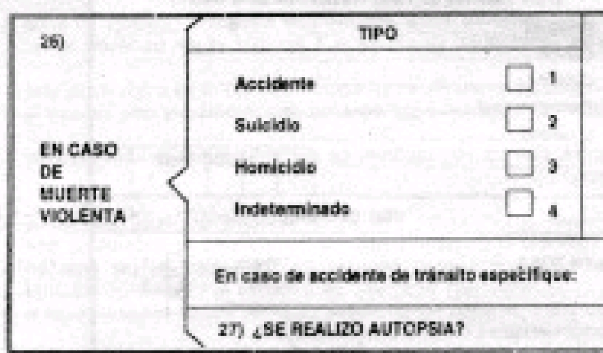
<figcaption aria-hidden="true">Figura 1. Pregunta “Tipo presuntivo de la
causa externa”. Formulario del año 1990.</figcaption>
</figure>

<figure>
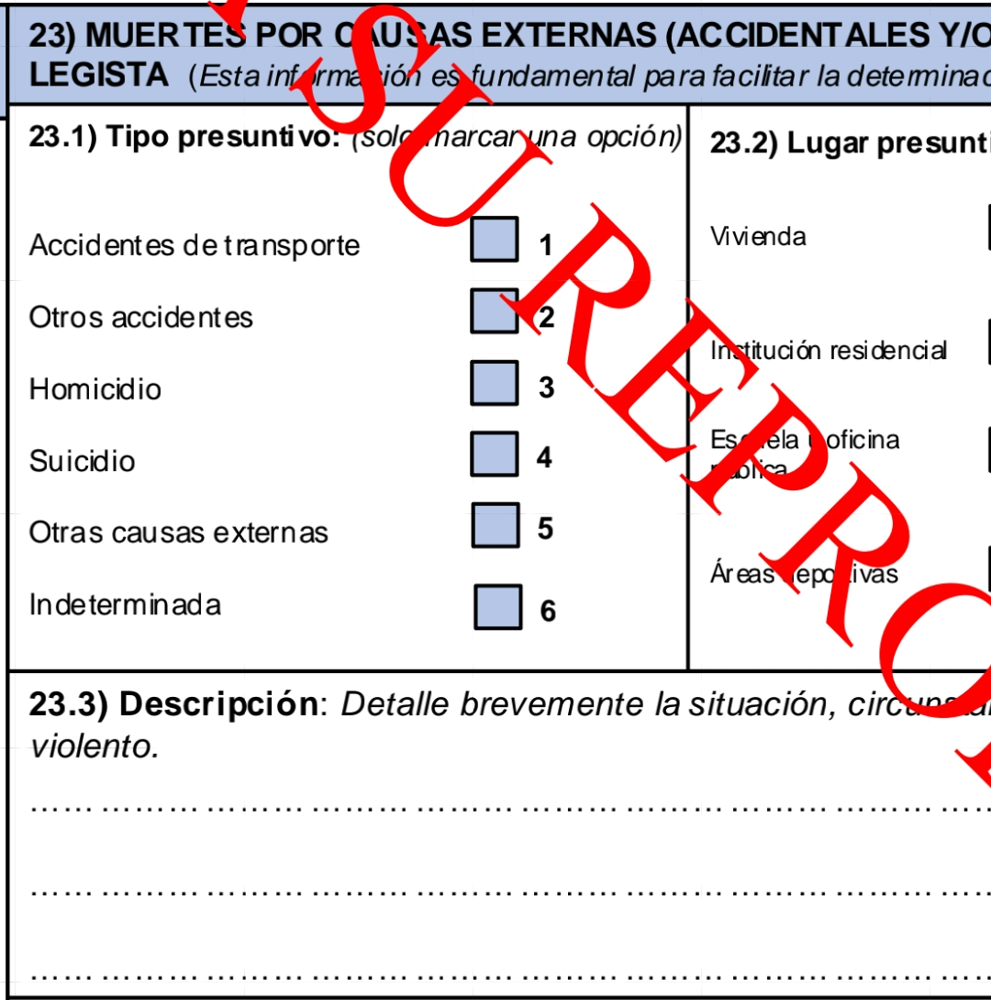
<figcaption aria-hidden="true">Figura 2. Pregunta “Tipo presuntivo de la
causa externa”. Formulario del año 2022.</figcaption>
</figure>

La CIE recomienda el uso de una variable, en los informes estadísticos
de defunción general, para determinar la intencionalidad probable del
hecho violento. Mismo que determina la categoría donde debe ser
clasificada la causa de muerte. Dicha variable es el tipo presuntivo de
la causa externa (Figura 1) (Figura 2).

Es de observar que existe una categoría específica para los casos dónde
el médico certificante no puede determinar la intencionalidad. La CIE-10
aclara muy bien este punto en su Volumen 1:

> Eventos de intención no determinada  
> (Y10–Y34)
>
> \[Ver nota al inicio de este capítulo sobre o lugar de ocurrencia\]
>
>  ***Nota:***      Esta sección cubre eventos donde la información
> disponible es insuficiente para que la autoridad médica o legal pueda
> distinguir entre accidente, lesión autoinfligida y agresión. Incluye
> lesiones autoinfligidas, pero no envenenamiento, cuando no se
> especifica si el daño fue accidental o intencional (X40–X49).

En otras palabras, si durante el registro del informe estadístico se
omite esta variable, la CIE especifica que los únicos casos donde se
debe asumir intencionalidad es en los envenenamientos.

### Las memorias técnicas de las defunciones generales

Dar lectura a la historia del registro de las defunciones, representa la
oportunidad de conocer los acontecimientos que podrían explicar cambios
abruptos en las series temporales de las defunciones, generando un
mecanismo objetivo y técnico para la elaboración de conclusiones.

Es en este documento que se explica:

> … Hasta el año 2014, en el Anuario de defunciones, se presentaba
> información de los hechos oportunos correspondientes a las defunciones
> ocurridos en el año de estudio, en este año el Instituto Nacional de
> Estadística y Censos, también recaba la información de registros de
> defunciones generales de inscripciones tardías, … en el año 2015. …

Además se extiende:

> … Desde el año 2014 el INEC registra en la base de datos de
> defunciones las muertes extemporáneas (registro de defunciones
> ocurridas en años anteriores al año de investigación), las cuales
> representan alrededor del 1%, por lo cual se procedió ajustar las
> cifras del año 2013 en adelante, con el objeto de contar con cifras
> actualizadas …

Bajo este contexto se puede esperar que, a niveles generales, se
incremente las tasas de defunción respecto a los años anteriores al
2013. Con ello, se contaría con las defunciones ocurridas en el año
inmediato anterior y que son inscritas en el año de estudio.

Y, quizá uno de los párrafos más importantes del documento para
comprender la ausencia de indeterminadas desde 2016:

> … Desde el año 2017, se utilizaron datos provenientes del registro de
> muertes de causas externas y de egresos hospitalarios, lo que permitió
> la identificación y mejora de la causa básica de defunción …

La implicación directa de la mención anterior es que, a partir del
registro de otras fuentes primarias, se espera el mejoramiento de la
causa básica en las defunciones por hechos violentos. En otras palabras,
se puede esperar una disminución en las muertes violentas de intención
no determinada.

> … A partir del Anuario de Estadísticas Vitales 2017, el INEC incorpora
> en la presentación de los datos de defunciones la publicación de dos
> estados de cifras: i) cifras provisionales: se refiere a estadísticas
> preliminares o parciales, y corresponden a los datos o indicadores que
> se generan con información de las defunciones generales ocurridas en
> el año de estudio e inscritos hasta el 31 de diciembre del año
> investigación ii) cifras definitivas: se refiere a información final y
> concluyente, y corresponden a los datos o indicadores que se generan
> con información de las defunciones generales en el año de estudio e
> inscritos un año posterior a la ocurrencia del hecho. Los datos e
> indicadores reportados a partir de cifras provisionales no son finales
> ni irreversibles …

En consecuencia, los datos que se presenten en este artículo están
sujetos a reversibilidad, conforme a las publicaciones 2023 en adelante.

Por último, en el archivo de tabulados y series, del año 2023 *(Serie
1.1.5, Número de muertes violentas en el año (t+1) por sexo a nivel
nacional)*, se especifica lo siguiente:

> En el mes de agosto de 2024, el INEC accede a la información del
> Sistema de Muertes por Causas Externas y dentro de ellas las muertes
> violentas de la Policía Nacional y en procura de mejorar la
> información de la causa de muerte se realiza una reclasficación desde
> el año 2020 de las muertes que corresponde a Eventos de intención no
> determinada
>
> **d\***) cifras definitivas: hasta el año 2019 corresponden a los
> datos o indicadores que se refiere a información final y concluyente
> que se generan con información de las defunciones generales ocurridas
> en el año de estudio.
>
> **p\*\***) cifras provisionales: corresponden a los datos o
> indicadores que se generan con información de las defunciones
> generales ocurridas desde el año 2020 en adelante y que están sujetos
> a ajustes por registros posteriores, debido a que existen procesos se
> no han sido finalizados como es la mejora de causa de fallecimiento de
> las muertes relacionadas por COVID-19; y, además para el año 2020
> todavía no se ha finalizado el proceso de Búsqueda Intencionada y
> Reclasificación de Muerte Materna - BIRMM, entre el INEC y MSP.
>
> Fuente: Registro estadístico de defunciones generales, años 1990-2023.

Con ello se establece que se ha realizado modificaciones a las cifras
publicadas entre 2020 y 2022 mediante el registro de fuentes primarias.
Lo esperado es que el número de muertes violentas de intención no
determinada, del año 2021, se haya reducido.

## Muertes violentas desde 1990 hasta 2023

### Introducción a los conjuntos de datos publicados

Observando cada conjunto de datos anual, se evidenció la necesidad de
realizar un preprocesamiento exhaustivo, bajo las siguientes novedades:

- Los nombres de las variables a emplearse, cambian conforme al año.

- En 1990 y, hasta 1996, el INEC empleó la CIE-9 para la clasificación
  de la causa básica de defunción. Fue hasta 1997 que ejecutó la
  transición a la CIE-10. Esto es muy importante ya que se requiere
  generar la correspondencia entre las dos revisiones de la CIE, con el
  fin de elaborar una serie más robusta.

- Para el cálculo de las tasas, se empleó las proyecciones de población
  citadas en los “Tabulados y series históricas” de la publicación 2023.
  Además se consideró el método ***defunciones generales registradas en
  (t+1)**,* implementado desde el anuario 2017.

- La intencionalidad de las causas externas fue clasificada de acuerdo a
  las categorías CIE y no al tipo presuntivo ya que, de existir
  inconsistencias, se prioriza el contenido específico y completo de los
  códigos en la Clasificación. Con ello, además, se realizó una
  categorización consistente en la tabla de correspondencia CIE-9/CIE-10
  debido a que el INEC comete el error de incluir los efectos tardíos en
  cada tipo de intencionalidad, con la CIE-9, pero los mismos son
  excluídos hacia la categoría de “Otras causas externas” en la CIE-10.
  Por tanto, la tabla de correspondencia empleada fue la siguiente:

  <table style="width:99%;">
  <caption>Tabla 1. Tabla de correspondencia de intencionalidad/CIE, entre
  revisiones.</caption>
  <colgroup>
  <col style="width: 30%" />
  <col style="width: 50%" />
  <col style="width: 18%" />
  </colgroup>
  <thead>
  <tr class="header">
  <th>Tipo presuntivo</th>
  <th>CIE-9</th>
  <th>CIE-10</th>
  </tr>
  </thead>
  <tbody>
  <tr class="odd">
  <td>Accidentes de transporte</td>
  <td>(800-848)</td>
  <td>(V01-V98)</td>
  </tr>
  <tr class="even">
  <td>Otros accidentes</td>
  <td>
(849-869)

  
(880-928)
</td>
  <td>(W00-X59)</td>
  </tr>
  <tr class="odd">
  <td>Homicidios</td>
  <td>(960-968)</td>
  <td>(X85-Y09)</td>
  </tr>
  <tr class="even">
  <td>Suicidios</td>
  <td>(950-958)</td>
  <td>(X60-X84)</td>
  </tr>
  <tr class="odd">
  <td>Otras causas externas</td>
  <td>Todas la demás, clasificadas en (800-999)</td>
  <td>(Y35-Y98)</td>
  </tr>
  <tr class="even">
  <td>Indeterminadas</td>
  <td>(980-988)</td>
  <td>(Y10-Y34)</td>
  </tr>
  </tbody>
  </table>

  Tabla 1. Tabla de correspondencia de intencionalidad/CIE, entre
  revisiones.

- Las tasas calculadas mediante el código CIE, podría presentar
  variaciones respecto al cálculo realizado con la variable que recaba
  el tipo presuntivo del hecho violento, pero se espera diferencias
  mínimas.

- En los años 2020, 2021 y 2022, el INEC cuenta con el registro de los
  datos originales y posteriores al cruce con las fuentes de información
  primaria, por lo que que podemos establecer qué cambios hubo luego de
  los cruces.

- Para el análisis del lugar de fallecimiento, se implementó la
  reclasificación de esta variable, así:

  - Casa: El fallecimiento sucedió dentro de un domicilio.

  - Establecimiento: El fallecimiento ocurrió en un ambiente destinado a
    la atención médica (hospitales, centros de salud, clínicas,
    consultorios médicos, entro otros).

  - Otro: Cualquier lugar que no es un domicilio o un ambiente destinado
    a la atención de la salud (vía pública, playa, escuela, parque,
    entro otros).

  Es importante mencionar que el INEC recaba las variables del lugar de
  fallecimiento y del lugar donde ocurrió un hecho violento, cuando este
  es la causa básica de defunción. Ambos lugares podrían ser
  completamente distintos, e.g. un peatón atropellado en la vía pública
  pero cuyo fallecimiento ocurrió en un hospital, producto del
  accidente.

### Resolviendo el misterio

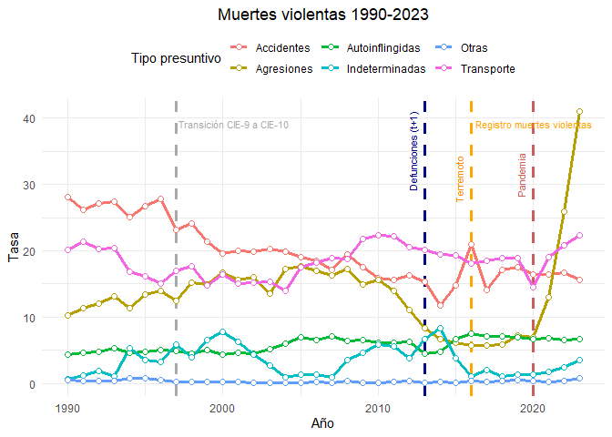

Figura 3. Elaboración propia. Fuente: INEC - defunciones generales (1990
hasta 2023).

Para el desarrollo completo de la serie de datos se investigó todos los
tipos de muertes violentas, especificados en la CIE y ajustados por la
metodología del INEC, además se estableció posibles puntos de inflexión
que determinen cambios importantes en el tiempo. Dichos puntos son:

1.  La transición de la novena revisión de la CIE a la décima, en el año
    1997.

2.  La incorporación de las defunciones inscritas en el año inmediato
    posterior al estudio: Defunciones (t+1), desde 2013.

3.  El terremoto ocurrido en Manabí, en el año 2016.

4.  El inicio del cruce de información, documentado, entre los informes
    estadísticos de defunción general del INEC y el registro de muertes
    violentas de DINASED, desde el año 2016 (Aunque la tasa de
    indeterminadas decrece en 2015, respecto al 2014, no existe sustento
    documental para ser incluido).

5.  La emergencia sanitaria debido a COVID-19, en 2020.

En el marco de estos eventos, apolíticos, se puede evidenciar:

- Hubo un incremento significativo de las causas externas de intención
  no determinada, a partir de la implementación de las defunciones en
  (t+1). Al mismo tiempo se observa un decrecimiento de los homicidios,
  pero también de las muertes accidentales y los suicidios.

- En 2016, las muertes accidentales tuvieron un incremento muy marcado,
  llegando a superar la tasa por accidentes de transporte y que, podría
  ser explicado por el terremoto ocurrido el 16 de abril de ese año.
  Además, el cruce de información con el registro de muertes violentas
  permitió llevar la tasa de muertes externas de intención no
  determinada a niveles marginales; considerando que la tasa de
  homicidios no regresa a valores superiores a los 10 puntos si no hasta
  el año 2021.

- Aunque la tasa de mortalidad general, durante la crisis sanitaria del
  2020, presentó un fuerte incremento; los accidentes de transporte
  disminuyeron hasta alcanzar valores menores a las muertes por otros
  accidentes.

> Nota personal:
>
> Entre los años 1990 a 1993 y 2004 a 2007, las tasas de muertes
> violentas de intención no determinada son tan bajas como las de los
> años posteriores al cruce con fuentes primarias (2016 en adelante) y,
> sin embargo, el documento histórico no registra eventos que expliquen
> este comportamiento. Con ello no se pretende cuestionar la veracidad
> en las cifras de esos períodos, solo se resalta la falta de
> información complementaria para entender la serie histórica. Además,
> se conoce que la CIE-10 sufrió varias actualizaciones (cambios en los
> códigos y en las reglas para seleccionar la causa básica de defunción)
> desde su implementación: no hay registro de los años en los que se
> ejecutaron dichas actualizaciones.

<figure>
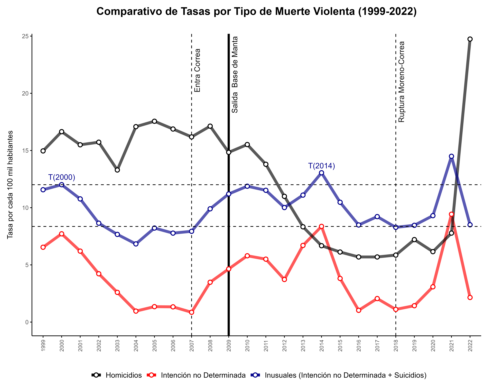
<figcaption aria-hidden="true">Figura 4. Fuente: Arduino Tomasi. The Pax
Narca Files.</figcaption>
</figure>

En una de sus gráficas, Tomasi pretende realizar una comparación entre
las tasas de homicidios e indeterminadas, decidiendo excluir del
análisis el resto de intencionalidades, pero además, realiza una suma
arbitraria de los suicidios y las indeterminadas. Entonces ¿existe
evidencia técnica que respalde su decisión?. Demos un vistazo a los
coeficientes de correlación entre todos los tipos de intencionalidad que
componen las muertes violentas: si las indeterminadas incrementan, algo
debe estar disminuyendo.

Lo cierto es que existe una correlación más consistente entre las
indeterminadas y los suicidios, que con los homicidios. Sin embargo,
sería inadecuado plantear que todas las indeterminadas son suicidios.

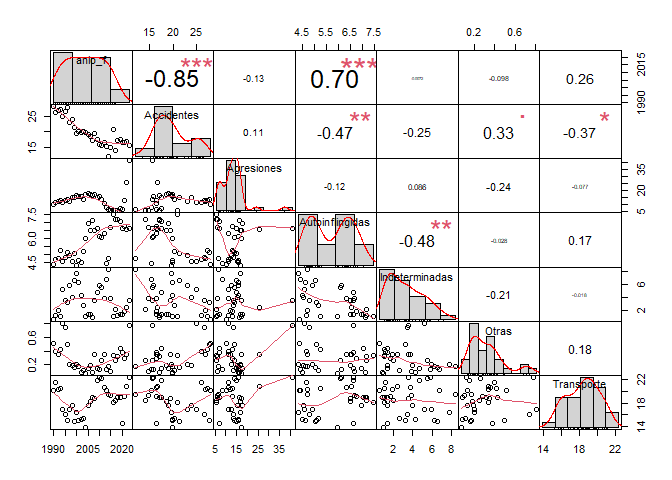

Figura 5. Correlación entre los tipos de intencionalidad (1990-2023).
Método Spearman.

Ahora hay que prestar atención a la oportunidad de analizar períodos
continuos con cambios metodológicos radicales: defunciones (t+1) y el
cruce con el registro de muertes violentas.

Si se analiza el período **2013-2023**, donde ocurren desde catástrofes
naturales hasta masacres carcelarias, pero también se toman decisiones
para mejorar la calidad del registro administrativo, podemos evidenciar
la relación inversa de las indeterminadas con las causas accidentales y
suicidios. Se tiene así, en los años 2013 y 2014, una elevada tasa de
indeterminadas, pero también una importante contracción de las muertes
accidentales y autoinflingidas (ver Figura 3). Con ello lo transparente
sería examinar todos los tipos de intencionalidad, no solo las
agresiones.

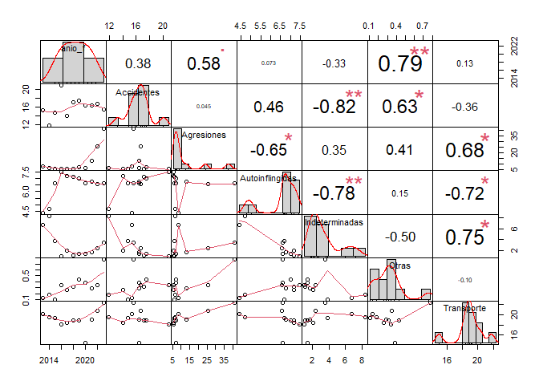

Figura 6. Correlación entre los tipos de intencionalidad (2013-2023).
Método Spearman.

En **The Pax Narca Files** se plantea una hipótesis, por lo menos
irresponsable, que causa cierto ruido técnico:

> … si la tasa de homicidios se redujo significativamente … entonces las
> violentas de intención no determinada deberían reflejar una tendencia
> descendente o, como mínimo, una estabilidad. …

¿Por qué la reducción de los homicidios debería reflejar lo mismo en las
indeterminadas? Pues lo cierto es que el singular escenario en el que
dicha hipótesis tiene sentido es en el que el único tipo de
intencionalidad determinada es la agresión, pero por el contrario,
además existen sucesos de transporte, suicidios, muertes accidentales y
otros tipos de causas externas (mala práctica médica, secuelas de causas
externas, uso legal de la fuerza, entre otras).

> Nótese que el uso progresivo de la fuerza no se clasifica como
> agresión/homicidio, ya que cuenta con sus propias categorías
> **CIE-10** (*Y35-Y36*) y **CIE-9** (*E970-E978*), correspondientes a
> la intervención legal por parte de las autoridades.

Sabiendo lo anterior, el deber honesto del analista sería cuantificar
los principales factores que causan muertes violentas y verificar su
relación con los tipos de intencionalidad, antes de intentar vincular la
ausencia de especificación con un tipo determinado de evento (ver Figura
7).

| Intencionalidad | CIE-10 | Descripción                                                                                                                             |
|-----------------|--------|-----------------------------------------------------------------------------------------------------------------------------------------|
| Accidentes      | X59    | Exposición a factores no especificados                                                                                                  |
| Accidentes      | W19    | Caída no especificada                                                                                                                   |
| Accidentes      | W74    | Ahogamiento y sumersión no especificados                                                                                                |
| Accidentes      | W84    | Obstrucción no especificada de la respiración                                                                                           |
| Accidentes      | W69    | Ahogamiento y sumersión mientras se está en aguas naturales                                                                             |
| Accidentes      | X09    | Exposición a humos, fuegos o llamas no especificados                                                                                    |
| Accidentes      | W87    | Exposición a corriente eléctrica no especificada                                                                                        |
| Accidentes      | X45    | Envenenamiento accidental por, y exposición al alcohol                                                                                  |
| Accidentes      | W17    | Otras caídas de un nivel a otro                                                                                                         |
| Accidentes      | W80    | Inhalación e ingestión de otros objetos que causan obstrucción de las vías respiratorias                                                |
| Agresiones      | X95    | Agresión con disparo de otras armas de fuego, y las no especificadas                                                                    |
| Agresiones      | X99    | Agresión con objeto cortante                                                                                                            |
| Autoinflingidas | X70    | Lesión autoinfligida intencionalmente por ahorcamiento, estrangulamiento o sofocación                                                   |
| Autoinflingidas | X69    | Envenenamiento autoinfligido intencionalmente por, y exposición a otros productos químicos y sustancias nocivas, y los no especificados |
| Indeterminadas  | Y34    | Evento no especificado, de intención no determinada                                                                                     |
| Indeterminadas  | Y24    | Disparo de otras armas de fuego, y las no especificadas, de intención no determinada                                                    |
| Indeterminadas  | Y19    | Envenenamiento por, y exposición a otros productos químicos y sustancias nocivas, y los no especificados, de intención no determinada   |
| Indeterminadas  | Y20    | Ahorcamiento, estrangulamiento y sofocación, de intención no determinada                                                                |
| Indeterminadas  | Y18    | Envenenamiento por, y exposición a plaguicidas, de intención no determinada                                                             |

Tabla 2. Causas externas CIE-10 más comunes según tipo de
intencionalidad.

| Intencionalidad | CIE-9 | Descripción                                                  |
|-----------------|-------|--------------------------------------------------------------|
| Accidentes      | 928   | ACCIDENTE POR CAUSA AMBIENTAL OTRO Y NEOM                    |
| Accidentes      | 910   | AHOGAMIENTO Y SUMERSION ACCIDENTAL                           |
| Accidentes      | 887   | FRACTURA CAUSA NEOM                                          |
| Accidentes      | 888   | CAIDA ACCIDENTAL OTRA Y NEOM                                 |
| Accidentes      | 884   | CAIDA DESDE NIVEL A OTRO                                     |
| Accidentes      | 899   | ACCIDENTE POR FUEGO NEOM                                     |
| Accidentes      | 925   | ACCIDENTE POR CORRIENTE ELECTRICA                            |
| Accidentes      | 913   | AHOGAMIENTO MECANICO ACCIDENTAL                              |
| Accidentes      | 905   | ACCIDENTE POR ANIMAL Y PLANTA VENENOSA                       |
| Agresiones      | 965   | AGRESION POR ARMA FUEGO Y EXPLOSIVO                          |
| Autoinflingidas | 950   | SUICIDIO Y ENVENENAMIENTO VOLUNTARIO POR SOLIDO O LIQUIDO    |
| Autoinflingidas | 953   | SUICIDIO Y LESION POR AHORCAMIENTO, ESTRANGULACION Y ASFIXIA |
| Indeterminadas  | 988   | LESION POR OTRO MEDIO Y NEOM CAUSA NEOM                      |
| Indeterminadas  | 980   | ENVENENAMIENTO CAUSA NEOM POR SOLIDO O LIQUIDO               |

Tabla 3. Causas externas CIE-9 más comunes según tipo de
intencionalidad.

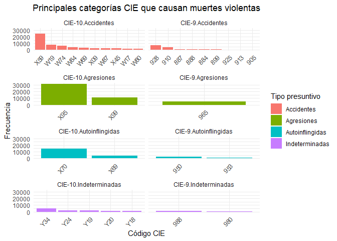

Figura 7. Elaboración propia. Fuente: INEC - defunciones generales
1990-2023.

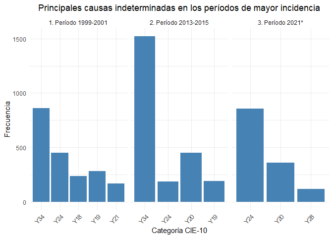

Figura 8. Elaboración propia. \*2021 provisional, antes del cruce con el
registro de muertes violentas.

Algo a considerar es que existen las categorías menos específicas para
cada tipo de intencionalidad, donde se desconoce el factor que causó la
muerte violenta, aunque se conozca la intencionalidad
(**CIE-10/CIE-9**): **X59/E928** cuando son muertes accidentales,
**X84/E958.9** para los suicidios, **Y09/E968.9** en agresiones y
**Y34/E988.9** al tratarse de intención no determinada.

Al evaluar la serie histórica, esperaríamos que esos códigos aparezcan
marginalmente pero, tanto en las muertes accidentales como
indeterminadas, no solo son representativas sino que se encuentran en el
primer lugar (ver **Figura 7**). Esto indica un grave problema de
calidad en la estadística de las defunciones generales, sobre todo
porque en **Y34** se anula por completo el tipo presuntivo y el factor
que produjo la muerte. Aún así, el comportamiento de factores
específicos muestra claras asociaciones con los tipos presuntivos: armas
blancas y de fuego con homicidios, ahorcamiento y envenenamiento por
plaguicidas con suicidios, ahogamiento por sumersión y caídas con
accidentes, entre otras.

Analizando las indeterminadas alrededor de los años con mayor incidencia
(2000 y 2014), se muestra una concentración preocupante en el código
menos específico de las muertes violentas, pero también se observa una
importante presencia de factores especificados dónde, las muertes por
arma de fuego tienen más prevalencia en el primer período, así como el
ahorcamiento es más frecuente en el segundo; lo que explicaría que las
indeterminadas estén correlacionadas inversamente con los suicidios. A
pesar de ello, **Y34** es más frecuente entre 2013 y 2015 por lo que
cabe preguntarse ¿los factores que se relacionan con los homicidios,
como **Y24**, fueron ocultados intencionalmente? y ¿dónde se explica la
relación entre las indeterminadas y las muertes accidentales?.

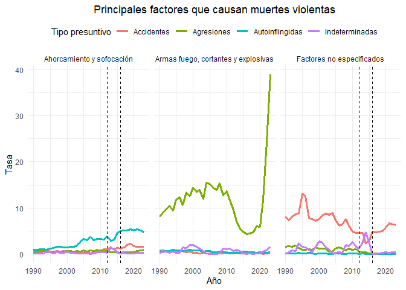

Figura 9. Elaboración propia. Fuente: INEC - defunciones generales
1990-2023.

Para responder las interrogantes se debe dirigir el enfoque hacia los
factores que causan la mayor cantidad de muertes violentas (nuevamente,
excluyendo los accidentes de transporte), permitiendo la evaluación de
su comportamiento respecto a los distintos tipos de intencionalidad.

1.  Ahorcamiento y sofocación: sería deshonesto vincular este factor con
    los homicidios cuando la evidencia muestra una fuerte relación con
    los suicidios.

2.  Armas de fuego, armas cortantes y materiales explosivos: sin lugar a
    dudas la prevalencia del resto de intencionalidades (incluyendo las
    no determinadas) frente a las agresiones, es marginal. No se debería
    concluir ocultamiento en este tipo de factores violentos.

3.  Factores no especificados: a partir de 2016 la presencia de ***Y34**
    (Evento no especificado, de intención no determinada)* es casi
    inexistente (un claro progreso debido al cruce con fuentes primarias
    actualizadas) y, sin embargo, entre 2013 y 2015 su pico histórico se
    encuentra acompañado de la menor prevalencia de ***X59** (Exposición
    a factores no especificados)* en toda la serie.

Con toda esta evidencia, resulta ilógico sostener que la presencia de
muertes violentas de intención no determinada está vinculada únicamente
con la disminución de homicidios, conociendo la presencia de factores
externos que se correlacionan fuertemente con otros tipos presuntivos de
intencionalidad.

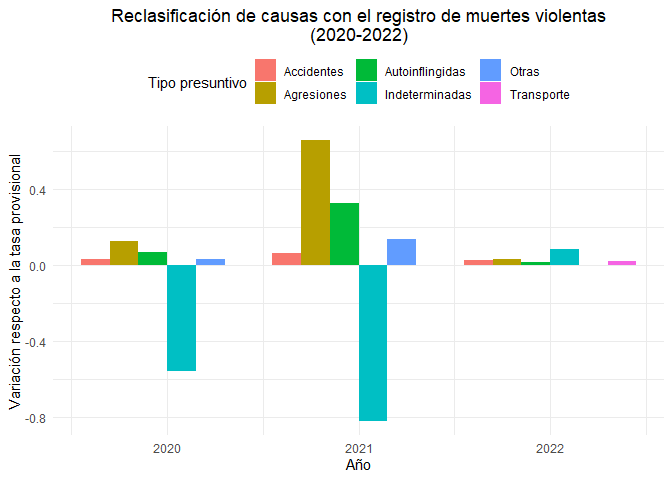

Figura 10. Elaboración propia. Fuente: INEC - defunciones generales
provisionales y actualizadas.

Una oportuna fuente de conclusiones es la reclasificación de muertes
violentas, mediante el registro de fuentes primarias (Policía Nacional,
DINASED), realizada con la publicación de la estadística de las
defunciones generales 2023; dónde se observa una clara redistribución de
las indeterminadas hacia el resto de tipos presuntivos.

- 2020: la tasa de indeterminadas decreció en un 55,56%.

- 2021: la tasa de indeterminadas disminuyó en un 81,90%, con un
  importante incremento de las agresiones (65,31%) y los suicidios
  (32,37%), lo que toma sentido cuando se observa las principales causas
  indeterminadas, provisionales, de ese período: armas blancas y de
  fuego, y ahorcamiento (ver Figura 8).

- 2022: la tasa de indeterminadas incluso incrementó respecto a la cifra
  provisional, pero ¿cómo es esto posible si se supone que los datos de
  fuentes primarias debería disminuirla?. Bueno, este fenómeno podría
  ser explicado por la incorporación de las **defunciones en (t+1)**. En
  otras palabras, existieron muertes violentas ocurridas en el año 2022,
  que fueron inscritas durante el 2023, en las que aún se desconoce la
  intencionalidad y que debe ser determinada por la institución adecuada
  mediante investigaciones posteriores.

Es así que se puede establecer que la presencia de muertes violentas de
intención no determinada es más normal de lo que se pensaba, siempre que
no existan mecanismos de mejoramiento posteriores a la captura de los
datos en los informes estadísticos; recordando que estos formularios son
un insumo inmediato y obligatorio para la inhumación legal de un
cadáver.

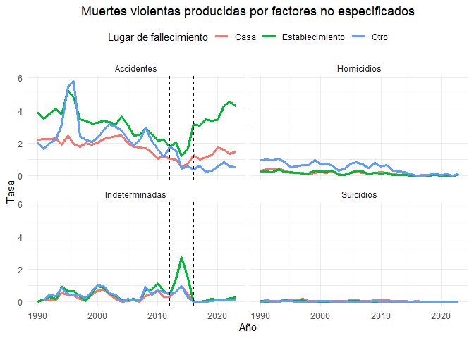

Figura 11. Elaboración propia. Fuente: INEC - defunciones generales
1990-2023.

Un hallazgo curioso es que la mayoría de las muertes violentas por
factores inespecíficos de intención no determinada (**Y34**), del
período **2013-2015**, ocurrieron con asistencia médica en
establecimientos de salud. Este aspecto, junto al decrecimiento de las
causas accidentales no especificadas en el mismo lapso temporal, fomenta
la hipótesis de que el incremento de las causas en **Y34** está
fuertemente relacionado con la disminución de la categoría **X59**.

Otro hecho relevante es que desde que se implementó el cruce con fuentes
primarias, todas las muertes por factores no especificados se volvieron
marginales, a excepción de las accidentales. Esto representa un nuevo
desafío para el mejoramiento del registro administrativo de mortalidad
en Ecuador ya que, aunque se explica la intencionalidad, se desconoce el
medio que provocó el fallecimiento (caída, accidente de tránsito,
sumersión, electrocución, entre otros). Sobre todo porque la categoría
menos específica de los accidentes se concentra en los establecimientos
de salud como lugar del deceso, con la seguridad de que se brindó algún
tipo de asistencia médica profesional al occiso. Entonces ¿por qué los
médicos certificantes están omitiendo la especificación de los factores?
¿falta de capacitación para el correcto llenado del informe estadístico?
¿temor a represalias legales o de otra índole?

Y, por supuesto, hay que dedicar un párrafo a las causas mal definidas
de mortalidad de las que las tan afamadas indeterminadas forman parte.
Lo cierto es que históricamente presentan una significativa reducción
pero, desde 2020, han tenido un comportamiento inusual. Para su correcto
estudio, la OPS clasifica estas causas en dos grupos: el tipo 1 (i) y el
tipo 2 (ii):

> i\. Muertes clasificadas como Síntomas, signos o hallazgos clínicos,
> no clasificados en otra parte (CIE-10 capítulo XVIII excluyendo R95
> Síndrome de muerte súbita del lactante, CIE-11 capítulo 21, excluyendo
> MH11 Síndrome de muerte súbita del lactante)
>
> ii\. Las causas de muerte vagas o no especificadas en otros capítulos
> de la CIE-10, incluyen las de la lista a continuación. Éstos se pueden
> asignar a los códigos ICD-11 correspondientes utilizando la
> herramienta de mapeo ICD15 . Además, dado que los códigos específicos
> de la CIE-10 y la CIE-11 pueden cambiar con el tiempo, el usuario
> también debe consultar las tablas de referencia de GBD para la CIE-10
> y la CIE-11 dentro de la herramienta, ubicadas entre los elementos de
> material de referencia. En la fila situada en la parte inferior de
> estas tablas, con la etiqueta “Enfermedad mal definida”, se encuentran
> los códigos CIE correspondientes a ellas.
>
> • A40-A41 Septicemia estreptocócica y otras • C76, C80, C97 Sitios
> cancerosos mal definidos • D65 Coagulación intravascular diseminada
> \[síndrome de desfibrinación\] • E86 Depleción de volumen • I10
> Hipertensión esencial (primaria) • I269 Embolia pulmonar sin mención
> de cor pulmonale agudo • I46 Paro cardíaco • I472 Taquicardia
> ventricular • I490 Fibrilación ventricular y aleteo • I50
> Insuficiencia cardíaca • I514 Miocarditis no especificada • I515
> Degeneración miocárdica • I516 Enfermedad cardiovascular, no
> especificado • I519 Enfermedad cardíaca no especificada • I709
> Aterosclerosis generalizada y no especificada • I959 Hipotensión, no
> especificada • I99 Otros trastornos del sistema circulatorio no
> especificados • J81 Edema pulmonar • J96 Insuficiencia respiratoria,
> no clasificada en otra parte • K72 Insuficiencia hepática, no
> clasificada en otra parte • N17 Insuficiencia renal aguda • N18
> Insuficiencia renal crónica • N19 Insuficiencia renal no especificada
> • P285 Insuficiencia respiratoria del recién nacido • Y10-Y34, Y872
> Causa externa de muerte no especificada como accidental o intencional.

Aunque el tipo 1 muestra una marcada tendencia a la baja (lo que es un
buen síntoma para la calidad de este registro), las mal definidas de
tipo 2 se incrementaron durante la crisis sanitaria y no han mostrado
signos de reversibilidad a partir de ese entonces. Esto compromete
seriamente las aspiraciones del país en pro de la calidad de las
publicaciones estadísticas de la mortalidad.

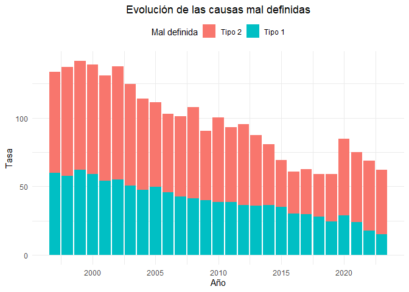

Figura 12. Elaboración propia. Fuente: INEC - defunciones generales
1990-2023.

Frente a toda la evidencia presentada, sería irresponsable mantenerse en
la postura anecdótica de que el incremento de las indeterminadas,
durante cualquier período, responda al ocultamiento deliberado o la
manipulación de datos. Ignorar la oportunidad de realizar un análisis
meticuloso solo perpetúa la falta de transparencia y honestidad,
desviando la atención de los temas subyacentes de mayor relevancia.

Para abordar efectivamente este tipo de hipótesis, se requiere un
enfoque basado en la evidencia pero, además, en el conocimiento técnico
de verdaderos expertos en el tratamiento de un registro estadístico tan
sensible como el de las defunciones. Solo si se deja de generar
discursos sesgados y carentes de comporomiso objetivo, se podrá avanzar
en la dirección de las verdaderas soluciones que se aproximen al
bienestar común y definitivo.

*Un mentemático curioso.*

